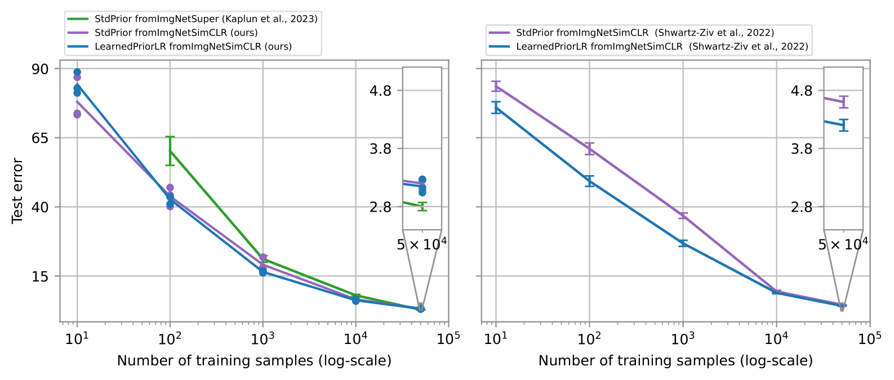

# bdl-transfer-learning

[A Replication Study of Transfer Learning with Informative Priors: Simple Baselines Better than Previously Reported]() by Ethan Harvey*, Mikhail Petrov*, and Michael C. Hughes

Figure 1: Error rate (lower is better) vs. target train set size on CIFAR-10, for various MAP estimation methods for transfer learning from ImageNet. Left: Our results. Right: Results copied from Shwartz-Ziv et al. (2022) (their Tab. 10). Takeaway: In our experiments, standard transfer learning does better than previously reported. Setting details: The blue and purple lines across both panels come from comparable settings: a common ResNet-50 architecture and common learned values for mean and low-rank (LR) covariance taken directly from the SimCLR pre-trained snapshots in Shwartz-Ziv et al. (2022)’s repository. Green line: The left panel’s green line is a third-party experiment copied from Kaplun et al. (2023), suggesting others can achieve similar performance as we do for standard transfer learning with ResNet-50. They use fully-supervised pre-training not self-supervised SimCLR. Plotted mean and standard deviations confirmed via direct correspondence with Kaplun et al..

## Installing Enviroment
See `bdl-transfer-learning.yml`.

## Downloading Shwartz-Ziv et al. (2022)'s SimCLR ResNet-50 prior/initialization
Shwartz-Ziv et al. (2022)'s pre-trained prior can be found at https://github.com/hsouri/BayesianTransferLearning. In our paper, we use `resnet50_ssl_prior`.

## Downloading our experiments

## Citation
